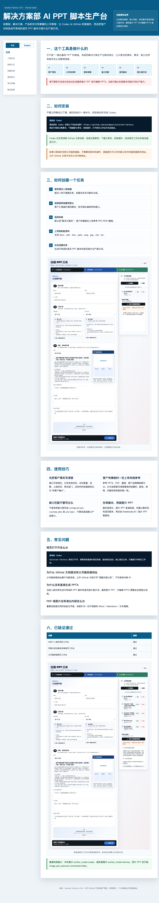

# Solution Factory

[中文](README.md) | [English](#english)

## English

Solution Factory is an AI-assisted PPT script workbench for solution, presales, product, and delivery teams. It turns customer materials, company knowledge, presentation intent, and style references into reviewable page-level PPT scripts and image-production prompts.

## Codex Installation Prompt

Do not download, unzip, or install the package manually. Copy this prompt to Codex:

```text
Please install the Codex plugin from this URL: https://github.com/Daviddwt/solution-factory
Read the notes, download the latest release package, install the plugin, open the web workbench, and verify it works.
```

## Visual Guide



Visual guide file: [docs/tutorial-web/index.html](docs/tutorial-web/index.html)

When sharing with colleagues, send only the Codex installation prompt above. Let Codex read the repository notes, download the latest release package, install the plugin, open the web workbench, and verify it works.

## Current Capability Boundary

```text
customer materials + company knowledge + presentation intent + PPT style references
-> requirement decomposition
-> capability matching
-> implementation path
-> page-level PPT scripts
-> page-level image-production prompts
-> Markdown / ZIP handoff package
```

This version does not automatically generate final image PPT files or editable PPTX files. Image PPT generation and editable PPT reconstruction are downstream workflows.

## Who It Helps

- Solution teams: decompose customer needs into scenarios, processes, capability boundaries, and page-level scripts.
- Presales teams: turn customer materials and company capabilities into reviewable presentation narratives.
- Product teams: use FRS, product manuals, and case materials to support capability matching.
- Delivery teams: identify interface, data, permission, workflow, and implementation boundaries early.

## Usage Tips

- Upload customer requirements, meeting notes, existing system descriptions, interface details, and business process materials first.
- Then upload company product FRS files, product manuals, case materials, and company profile materials.
- If a specific PPT style is required, upload reference PPT/PDF/screenshots.
- Mark content without evidence as "to be confirmed".
- Requirements outside existing product capabilities should be labeled as `integration`, `custom_dev`, or `unclear`.

## Company Server

If your company provides a shared server version, get the URL from the internal announcement. Public GitHub documentation should not expose internal network addresses.

## Safety Boundary

- Do not publish contract bodies, price details, invoices, personal information, or non-sanitized customer materials.
- Do not expose internal server addresses in public documentation.
- This plugin produces scripts and prompts. It must not present downstream image PPT or editable PPTX generation as connected unless those capabilities are separately verified.
