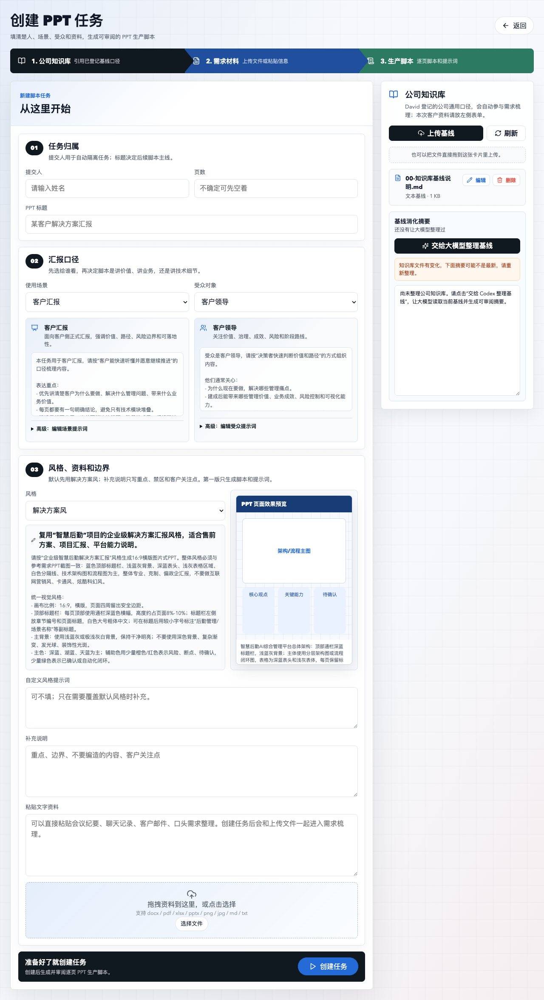

# 解决方案部 AI PPT 脚本生产台使用指南

> 适用对象：解决方案、售前、产品、交付同事  
> 更新时间：2026-06-21  
> 当前版本：Solution Factory v1.0.0  
> 当前定位：PPT 脚本生产台，不是最终图片 PPT / 可编辑 PPTX 生成器

## 一句话介绍

Solution Factory 是解决方案部内部使用的 AI 工具。它不是“一键出最终 PPT”的黑盒，而是把前期最耗时间、最容易乱的工作标准化：

```text
客户资料 + 公司知识库 + 汇报口径 + PPT风格要求
-> 需求梳理
-> 能力匹配
-> 实现路径
-> 逐页 PPT 脚本
-> 逐页图片生产提示词
-> Markdown / ZIP 交付包
```

请特别注意：当前工具的真实生产边界是 **脚本和提示词生产**。图片 PPT 生成、图片 PPT 转可编辑 PPTX 是后续独立流程，不要把当前工具说成已经自动完成最终 PPT。

## 如何安装

不要自己手动下载、解压和分步安装。直接把下面这句话复制给 Codex：

```text
请给我的 Codex 安装以下地址的插件：https://github.com/Daviddwt/solution-factory
请自行读取注意事项、下载最新分享包、安装插件、打开网页工作台并完成验证。
```

Codex 会负责读取 GitHub 仓库说明、检查注意事项、下载分享包、安装插件、启动网页工作台并验证能否打开。

如果你只是临时试用公司服务器版，不需要安装本机插件，请直接打开公司内部公告中的服务器网页地址。公开 GitHub 文档不会写公司内网地址。

## 谁适合用

- 要给客户做方案汇报，但手头资料很多、口径容易乱。
- 要把客户需求拆成场景、流程、系统、数据、接口、AI 能力。
- 要把公司产品能力和客户需求做匹配，避免乱承诺。
- 要把 PPT 每一页讲什么、用什么图、引用什么资料先写清楚。
- 要把 NotebookLM / 图片 PPT 智能体需要的提示词提前组织好。

## 怎么创建一个任务

打开网页工作台后，从上到下填写。



### 1. 填写任务归属

- **提交人**：写自己的名字，系统会按提交人隔离任务。
- **页数**：不确定可以先空着；如果客户要求 20 页、30 页，可以填目标页数。
- **PPT 标题**：例如“某客户智慧后勤解决方案汇报”。

### 2. 选择汇报口径

- **使用场景**：客户汇报、内部评审、投标准备、方案预沟通。
- **受众对象**：客户领导、业务负责人、技术团队、方案团队。

不同选择会影响脚本表达方式。客户领导更关注价值、路径和风险边界；技术团队更关注架构、接口、数据流和实现约束。

### 3. 补充风格、资料和边界

- **风格**：默认先用“解决方案风”。
- **自定义风格提示词**：客户有模板时再填。
- **补充说明**：写客户关注点、不要编造的内容、必须体现的产品能力。
- **粘贴文字资料**：可以粘贴会议纪要、客户聊天记录、口头需求。
- **上传资料**：支持 `docx / pdf / xlsx / pptx / png / jpg / md / txt`。

最后点击 **创建任务**。

## 使用技巧

### 技巧一：先把客户事实写清楚

工具最怕“资料不够但要求写得很确定”。建议在补充说明里写：

```text
以下内容必须标记为待客户确认：接口开放情况、已有系统状态、点位数量、金额、上线时间、责任部门。
```

这样生成脚本时会更稳，不容易乱承诺。

### 技巧二：客户有模板时，一定上传风格参考

如果客户要求跟某个 PPT 风格一致，请上传：

- 参考 PPTX
- 参考 PDF
- 截图
- 客户品牌模板
- 以前通过评审的方案胶片

并在补充说明里写：

```text
请参考我上传的模板风格，优先保持标题栏、配色、表格样式、页脚和架构图风格一致。
```

### 技巧三：能力匹配不要写过头

如果客户需求不是现有产品能力，允许写成：

- `integration`：需要系统集成
- `custom_dev`：需要定制开发
- `unclear`：信息不足，待确认

不要把需要集成或定制的内容包装成“现有产品默认能力”。

### 技巧四：复杂项目先做“需求脚本”，再做图片 PPT

建议顺序：

```text
先审需求包和逐页脚本
-> 再交给 NotebookLM / 图片 PPT 智能体做图片页
-> 最后走图片 PPT 转可编辑 PPTX 流程
```

脚本是源头，图片 PPT 只是渲染层。

### 技巧五：本机版适合长期沉淀，服务器版适合快速试用

- 只是临时试一下：直接用公司服务器网页。
- 经常做方案：建议让 Codex 从 GitHub 安装本机插件，本地沉淀资料和任务。

## 常见问题

### 1. 打开网页显示无法访问

不要自己排查命令。直接告诉 Codex：

```text
Solution Factory 网页打不开，请帮我检查插件是否安装、服务是否启动、端口是否占用，并重新打开网页工作台。
```

### 2. 为什么 GitHub 文档里没有公司服务器地址

公司服务器地址属于内部信息。公开 GitHub 文档只写“请看内部公告”，不写具体内网 IP。

### 3. 为什么工具没有直接生成 PPTX

这是设计边界。当前工具负责生成可审阅的 PPT 脚本和逐页图片提示词。最终图片 PPT、可编辑 PPTX 需要走后续独立流程，不能混在一起说。

### 4. 上传 PDF 或图片后没有读出内容

当前对 PDF / 图片的可靠解析能力有限。重要信息建议同时粘贴文字版，或者补充一份可读取的 Word / Markdown / 文本摘要。

### 5. 可以给第三方用吗

可以给第三方下载分享包本地安装，但需要注意：

- 不要把公司内网服务器地址写进公开文档。
- 不要把公司知识库、客户资料、合同、报价、个人信息打进公开分享包。
- 第三方本机使用时，需要自己准备材料和知识库。

## 已验证情况

| 场景 | 结果 |
|---|---|
| David 本机个人插件网页工作台 | 已通过 |
| 同事分享包模拟安装网页工作台 | 已通过 |
| 公司服务器网页工作台 | 已通过 |

健康检查确认：

- 本机模式：`worker_mode=codex`
- 服务器模式：`worker_mode=hermes`
- 图片 PPT 执行器：`image_ppt_executor.connected=false`

## 给第一次使用同事的建议

第一次不要直接拿复杂投标材料上来试。建议先用一个简单客户场景，准备三类材料：

1. 客户需求简表或会议纪要。
2. 公司产品/能力材料。
3. 参考 PPT 风格截图。

跑通一次后，再用于正式客户项目。
